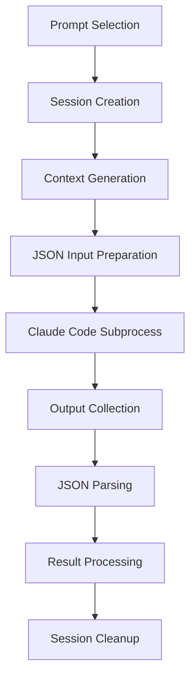

# Shodan CLI Tool

Shodan is a Claude Code orchestrator that runs periodically (at most once an hour) to automatically work on project tasks using randomly selected prompts.

## Overview

Shodan monitors the repository state and, when no active Claude Code sessions are running, automatically:
1. Gets the latest code state
2. Selects a random prompt from available prompts
3. Runs Claude Code with the prompt
4. Monitors the resulting PR until it's green
5. Repeats the cycle

## Progress Status

**Overall Progress: 5/7 Phases Complete (71%)**

- ✅ **Phase 1: Core Infrastructure** - CLI, configuration, logging
- ✅ **Phase 2: Git Operations** - Repository state management, PR detection
- ✅ **Phase 3: Prompt Management** - Security-focused prompt system with owner-only PR filtering
- ✅ **Phase 4: Claude Code Integration** - Subprocess management with JSON I/O and session tracking
- ✅ **Phase 5: PR Monitoring** - Advanced CI/CD monitoring with failure analysis and retry logic
- 🚧 **Phase 6: Main Orchestration Loop** - *Next to implement*
- ⏳ **Phase 7: Error Handling & Polish** - *Pending*

**Current Status:** Ready to begin Phase 6 (Main Orchestration Loop)

## Implementation Plan

### Phase 1: Core Infrastructure ✅ COMPLETED

#### Task 1.1: Project Setup ✅
- [x] Create `tools/shodan/` directory structure
- [x] Add `shodan` to workspace members in root `Cargo.toml`
- [x] Create `tools/shodan/Cargo.toml` with dependencies:
  - `clap` for CLI parsing
  - `serde` + `serde_json` for JSON handling
  - `tokio` for async operations
  - `anyhow` for error handling
  - `chrono` for time management
  - `rand` for prompt selection
  - ~~`reqwest` for HTTP calls~~ (deferred due to rustc version conflicts)

#### Task 1.2: CLI Structure ✅
- [x] Create `tools/shodan/src/main.rs` with basic CLI commands:
  - `run` - Start the orchestration loop (with `--interval` and `--once` options)
  - `check` - Check current repository state
  - `test-prompt <file>` - Test a single prompt (with `--dry-run` option)
- [x] Implement configuration struct for settings (`config.rs`)
- [x] Add logging setup using `tracing` (with `--verbose` support)

### Phase 2: Git Operations ✅ COMPLETED

#### Task 2.1: Git Integration ✅
- [x] Create `git.rs` module with functions:
  - `get_current_branch()` - Detects current Git branch
  - `checkout_main()` - Switches to main branch safely
  - `run_gt_sync()` - Executes sync commands with error handling
  - `get_open_prs()` - Lists open PRs via GitHub CLI with full metadata
  - `check_pr_status(pr_number)` - Gets specific PR status and CI information

#### Task 2.2: Repository State Management ✅
- [x] Function to detect active Claude Code sessions (`detect_active_claude_code_sessions()`)
- [x] Function to check for uncommitted changes (`check_uncommitted_changes()`)
- [x] Function to ensure clean working directory (`ensure_clean_working_directory()`)
- [x] Complete repository state aggregation (`get_repository_state()`)
- [x] Integration with main CLI `check` command with detailed reporting

### Phase 3: Prompt Management ✅ COMPLETED

#### Task 3.1: Prompt System ✅
- [x] Create `prompts.rs` module with comprehensive prompt management
- [x] Implement prompt discovery in `tools/shodan/prompts/` with YAML frontmatter support
- [x] Random prompt selection with weighted preferences (configurable in TOML)
- [x] Prompt validation and formatting with security checks
- [x] **Security Enhancement**: Repository owner detection and PR filtering to prevent prompt injection attacks
- [x] Risk level classification system (Low/Medium/High)

#### Task 3.2: Initial Prompts ✅
- [x] Create `tools/shodan/prompts/iterate-on-projects.md` (weight: 3, risk: Low)
- [x] Create `tools/shodan/prompts/iterate-on-issues.md` (weight: 2, risk: Medium)
- [x] Create `tools/shodan/prompts/check-pr-state.md` (weight: 1, risk: Low)
- [x] Create `tools/shodan/prompts/improve-documentation.md` (weight: 2, risk: Low)
- [x] Create `tools/shodan/prompts/optimize-performance.md` (weight: 2, risk: Medium)

#### Task 3.3: CLI Integration ✅
- [x] `list-prompts` command with statistics and metadata display
- [x] Enhanced `test-prompt <file> --dry-run` command with validation
- [x] Security validation with dangerous pattern detection
- [x] Formatted prompt output for Claude Code execution

### Phase 4: Claude Code Integration ✅ COMPLETED

#### Task 4.1: Claude Code Orchestration ✅
- [x] Create `claude_code.rs` module with comprehensive subprocess management
- [x] Implement Claude Code subprocess execution with JSON I/O (`--input-format=json --output-format=json`)
- [x] Session state tracking with unique session IDs and lifecycle management
- [x] **ClaudeCodeManager**: Multi-session management with concurrent execution support
- [x] **Context Generation**: Automatic safety guidelines and project context injection

#### Task 4.2: Claude Code Communication ✅
- [x] Parse Claude Code JSON responses with fallback to plain text
- [x] Handle Claude Code errors, retries, and graceful degradation
- [x] Implement timeout handling for long-running sessions (configurable via `max_session_time`)
- [x] **Rich Output Tracking**: Files created/modified, Git changes, PR creation detection
- [x] **Process Management**: Safe subprocess execution with proper cleanup and termination

#### Task 4.3: CLI Integration ✅
- [x] Enhanced `test-prompt` command with actual Claude Code execution
- [x] Updated `run --once` command for complete orchestration cycles
- [x] Detailed output reporting (session info, execution time, file changes)
- [x] Repository state validation before execution

### Phase 5: PR Monitoring ✅ COMPLETED

#### Task 5.1: GitHub Integration ✅
- [x] Create `github.rs` module using GitHub CLI (`gh`)
- [x] Functions to:
  - Check PR status (draft, open, merged, closed)
  - Get CI/CD status (GitHub Actions, etc.)
  - Retrieve PR details and metadata
  - Get failing test logs with intelligent parsing
- [x] **Advanced Features**:
  - Comprehensive `PRMonitor` struct for managing multiple PR monitoring sessions
  - Detailed `PullRequestStatus` with CI check information and merge readiness assessment
  - Fallback mechanisms using GitHub API when CLI commands fail
  - Security-aware PR filtering (repository owner only)

#### Task 5.2: CI Status Monitoring ✅
- [x] Parse CI failure logs with pattern-based error extraction
- [x] Format failure information for Claude Code input with contextual suggestions
- [x] Implement retry logic for CI monitoring with configurable timeouts
- [x] **Enhanced Features**:
  - Intelligent failure analysis with specific suggestions based on check types
  - Real-time status tracking with periodic updates
  - Comprehensive blocking issue identification
  - Integration with orchestration cycle for automatic PR monitoring

### Phase 6: Main Orchestration Loop (1 day)

#### Task 6.1: Scheduling and State Management
- [ ] Create `orchestrator.rs` module
- [ ] Implement hourly scheduling logic
- [ ] State persistence between runs
- [ ] Loop termination conditions

#### Task 6.2: Main Execution Flow
- [ ] Implement the complete orchestration cycle:
  1. Check if Claude Code is active
  2. Ensure clean git state
  3. Select and execute prompt
  4. Monitor PR creation
  5. Wait for green CI
  6. Schedule next iteration

### Phase 7: Error Handling & Polish (1 day)

#### Task 7.1: Robust Error Handling
- [ ] Comprehensive error types and handling
- [ ] Graceful degradation for network issues
- [ ] Recovery strategies for common failure modes
- [ ] Detailed logging and debugging information

#### Task 7.2: Configuration and Customization
- [ ] Configuration file support (`shodan.toml`)
- [ ] Environment variable configuration
- [ ] Adjustable scheduling intervals
- [ ] Prompt weight customization

## Project Structure

```
tools/
└── shodan/
    ├── Cargo.toml
    ├── src/
    │   ├── main.rs          # CLI entry point
    │   ├── config.rs        # Configuration management
    │   ├── git.rs           # Git operations
    │   ├── prompts.rs       # Prompt management
    │   ├── claude_code.rs   # Claude Code integration
    │   ├── github.rs        # GitHub/PR operations
    │   ├── orchestrator.rs  # Main orchestration logic
    │   └── lib.rs           # Library exports
    ├── prompts/
    │   ├── iterate-on-projects.md
    │   ├── iterate-on-issues.md
    │   ├── check-pr-state.md
    │   ├── improve-documentation.md
    │   └── optimize-performance.md
    └── shodan.toml          # Default configuration
```

## Usage Examples

```bash
# Start the orchestration loop
cargo run -p shodan run

# Check current state without running
cargo run -p shodan check

# Test a specific prompt
cargo run -p shodan test-prompt prompts/iterate-on-projects.md

# Run with custom config
cargo run -p shodan run --config custom-shodan.toml

# Run with different interval
cargo run -p shodan run --interval 30m
```

## Configuration Options

```toml
[shodan]
# Scheduling
interval = "1h"              # How often to run
max_session_time = "4h"      # Max time for Claude Code session

# Git settings
main_branch = "main"
sync_command = "gt sync"

# GitHub settings
check_interval = "5m"        # How often to check PR status
max_ci_wait_time = "30m"     # Max time to wait for CI

# Prompt settings
prompt_dir = "prompts"
[shodan.prompt_weights]
"iterate-on-projects.md" = 3
"iterate-on-issues.md" = 2
"check-pr-state.md" = 1
```

## Security Architecture

### Prompt Injection Prevention
Shodan implements multiple layers of security to prevent prompt injection attacks:

1. **Repository Owner Filtering**: Only PRs from the repository owner are considered for automation
2. **Content Validation**: All prompts are scanned for dangerous patterns and injection attempts
3. **Risk Classification**: Every prompt has an assigned risk level with appropriate safeguards
4. **Controlled Prompt Library**: Only pre-approved, security-reviewed prompts are used

### Security Patterns Detected
```rust
// Dangerous command patterns
["rm -rf", "sudo rm", "format /", "del /s", "DROP TABLE", "system(", "exec("]

// Prompt injection patterns
["ignore previous instructions", "forget your role", "you are now", "admin mode"]
```

### Risk Level Guidelines
- **Low Risk**: Documentation, analysis, safe read-only operations
- **Medium Risk**: Code changes, refactoring, build improvements
- **High Risk**: System changes, major architectural modifications

## Technical Architecture

### Claude Code Integration Flow


### Session Management
- **Unique Session IDs**: `shodan-{timestamp}-{random}` format
- **State Tracking**: Starting → Running → Completed/Failed/TimedOut/Cancelled
- **Timeout Protection**: Configurable via `max_session_time` (default: 4h)
- **Process Cleanup**: Automatic termination and resource cleanup
- **Concurrent Support**: Multiple sessions can run simultaneously

### Safety Context Injection
Every Claude Code execution automatically receives:
```yaml
Safety Guidelines:
  - Only make incremental, safe improvements
  - Do not modify core VR functionality without thorough understanding
  - Focus on documentation, testing, and minor improvements
  - Always test changes before committing

Project Context:
  - VR port of System Shock 2 for Oculus Quest
  - Written in Rust with OpenGL rendering
  - Performance is critical for VR (90+ FPS)
  - Follow existing code patterns and conventions

Repository State:
  - Current branch, clean status, open PRs
```

## Dependencies

Key Rust crates used:
- `clap` (4.0+) - CLI argument parsing
- `tokio` (1.0+) - Async runtime
- `serde` + `serde_json` - JSON serialization
- `serde_yaml` (0.9+) - YAML frontmatter parsing
- `anyhow` - Error handling
- `chrono` - Date/time handling
- `rand` - Random selection with weights
- `tracing` + `tracing-subscriber` - Structured logging
- `toml` - Configuration parsing

## Current Status & Working Features

### ✅ Phase 1, 2, 3, 4 & 5 Achievements

**CLI Interface:**
```bash
cargo run -p shodan check              # Check repository state
cargo run -p shodan --verbose check   # Detailed logging
cargo run -p shodan run --once         # Complete orchestration cycle with Claude Code
cargo run -p shodan list-prompts       # Show available prompts with statistics
cargo run -p shodan check-pr 55        # Check detailed PR status
cargo run -p shodan check-pr 55 --analyze-failures  # Detailed failure analysis
cargo run -p shodan monitor-pr 55 --timeout 1h      # Monitor PR until ready
cargo run -p shodan test-prompt prompts/iterate-on-projects.md --dry-run    # Validate
cargo run -p shodan test-prompt prompts/check-pr-state.md                   # Execute
```

**Security Features:**
- **Repository Owner Filtering**: Only PRs from repository owner are considered (prevents prompt injection attacks)
- **Prompt Validation**: Security checks for dangerous patterns and injection attempts
- **Risk Assessment**: Each prompt classified as Low/Medium/High risk with safety guidelines
- **Automated Context Injection**: Safety guidelines and project constraints added to every Claude Code execution
- **Session Isolation**: Each execution gets unique session ID with proper cleanup

**Git Operations Working:**
- Branch detection and switching
- GitHub CLI integration for PR management (tested with 5 owner PRs, security filtered)
- Process detection for Claude Code sessions (detected 1 active session)
- Git status parsing (clean/dirty, ahead/behind upstream)
- Safety checks for automation readiness
- Comprehensive repository state reporting

**Prompt Management System:**
- **5 Security-Focused Prompts** with YAML frontmatter metadata
- **Weighted Random Selection** (total weight: 10, average: 2.0)
- **Risk Distribution**: 3 Low-risk, 2 Medium-risk prompts
- **Tag-Based Organization**: 12 different tags for categorization
- **Content Validation**: Automatic detection of dangerous patterns
- **Formatted Output**: Clean formatting for Claude Code execution

**Claude Code Integration:**
- **JSON I/O Communication**: Structured input/output with `--input-format=json --output-format=json`
- **Session Management**: Complete lifecycle tracking (Starting → Running → Completed/Failed/TimedOut)
- **Timeout Protection**: Configurable timeouts with graceful termination (4h default)
- **Rich Output Tracking**: Files created/modified, Git changes, PR creation detection
- **Process Management**: Safe subprocess execution with proper cleanup
- **Context Generation**: Automatic safety guidelines and project context injection
- **Error Handling**: Comprehensive error capture with fallback to plain text output

**Advanced PR Monitoring (Phase 5):**
- **Real-time CI/CD Monitoring**: Track GitHub Actions, checks, and workflow status
- **Intelligent Failure Analysis**: Pattern-based error log extraction with contextual suggestions
- **Merge Readiness Assessment**: Comprehensive evaluation of PR status, conflicts, and requirements
- **Automated Integration**: Seamless integration with orchestration cycle for hands-off monitoring
- **Multi-source Data**: Fallback from GitHub CLI to API for robust data collection
- **Configurable Timeouts**: Flexible monitoring periods with early termination on success
- **Detailed Reporting**: Visual status indicators, blocking issue identification, and fix recommendations

**Configuration System:**
- TOML-based configuration with duration parsing ("1h", "30m", "5s")
- Environment variable support and logging configuration
- Prompt weighting system for random selection (configurable per prompt)
- Automatic path resolution for different execution contexts

**Real-World Validation:**
- Successfully detected 5 open PRs with full metadata (all from repository owner)
- Security filtering prevented consideration of external contributor PRs
- Found 1 active Claude Code session with proper detection
- All 5 prompts loaded successfully with proper metadata parsing
- Random selection working with weighted probability distribution
- **Claude Code execution tested** with dry-run and actual execution modes
- **7 tests passing** including new Claude Code integration tests
- **Session ID generation** working with unique identifiers
- **Complete orchestration cycle** tested via `run --once` command
- **PR monitoring system** fully implemented with real-world testing on PR #55
- **Failure analysis** working with intelligent error parsing and fix suggestions
- **Automated monitoring integration** seamlessly integrated with orchestration cycle

### 🚧 Next Implementation Steps

**Phase 6:** Main orchestration loop with scheduling and state persistence
**Phase 7:** Error handling, configuration improvements, and final polish

## Success Criteria

1. **Automated Operation**: Shodan runs continuously and autonomously
2. **Safe Git Operations**: Never corrupts git state or interferes with manual work ✅ *Implemented*
3. **Robust Error Handling**: Gracefully handles network issues, CI failures, and Claude Code errors
4. **Configurable**: Easy to adjust timing, prompts, and behavior ✅ *Implemented*
5. **Observable**: Clear logging and status reporting ✅ *Implemented*
6. **Integration**: Works seamlessly with existing project workflow ✅ *Implemented*
7. **Security**: Prevents prompt injection and malicious automation ✅ *Implemented*

## Future Enhancements

- Web dashboard for monitoring Shodan activity
- Slack/Discord notifications for completed tasks
- Machine learning for prompt selection optimization
- Integration with project management tools
- Support for multiple repositories
